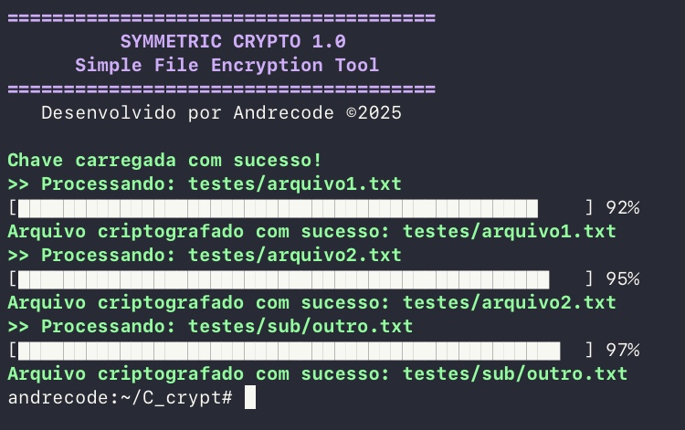

# C_crypto

Implementação simples de criptografia simétrica em C puro, com suporte a diretórios e subdiretórios.

## Interface no terminal



## Compilação

```bash
gcc main.c crypt.c -o crypt
```

## Uso

```bash
./crypt encrypt arquivo_ou_pasta caminho/para/chave.key
./crypt decrypt arquivo_ou_pasta caminho/para/chave.key
```
## ⚠️ Aviso

Este projeto é apenas para **fins educacionais**.  
**Não use em arquivos reais ou sensíveis.**  
O autor **não se responsabiliza** por perda de dados ou danos causados pelo uso deste software.

## Como contribuir

Se quiser ajudar a melhorar o projeto, corrigir bugs ou adicionar recursos, será muito bem-vindo!  

Para contribuir:

1. Faça um fork deste repositório.
2. Crie uma branch com sua feature ou correção (`git checkout -b minha-feature`).

---

Obrigado pelo interesse e bora codar! 🚀

